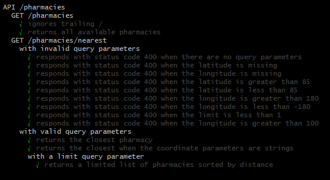

# rx-distance

A simple Hapi server used to find the nearest pharmacy when provided a latitude and longitude.

In order to avoid an end user from setting up a DB on their machine, I decided to just go with a client-side psuedo-database implementation, aka [AlaSQL](http://alasql.org/).

heroku: http://protected-temple-28543.herokuapp.com/api/v1/pharmacies

## Endpoints

- http://localhost:3000/api/v1/pharmacies - Gets all pharmacies
- http://localhost:3000/api/v1/pharmacies/nearest - Gets a limited list of pharmacies sorted by their distance to the provided longitude and latitude
  - options
    - longitude
    - latitude
    - limit [default: 1]

quicklink: http://localhost:3000/api/v1/pharmacies/nearest?longitude=13&latitude=37&limit=2

## Requirements

- Node: v11.14.0+
- NPM: v6.7.0+

## Getting Started

```
git clone https://github.com/edreesjalili/rx-distance.git
cd rx-distance
npm i
npm start
```

> **To run tests:** > `npm test`

## Test cases


